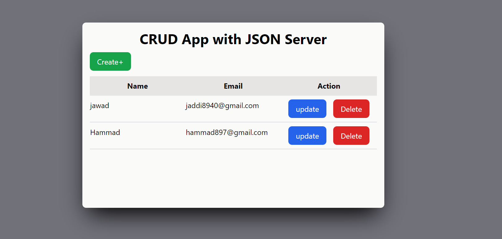
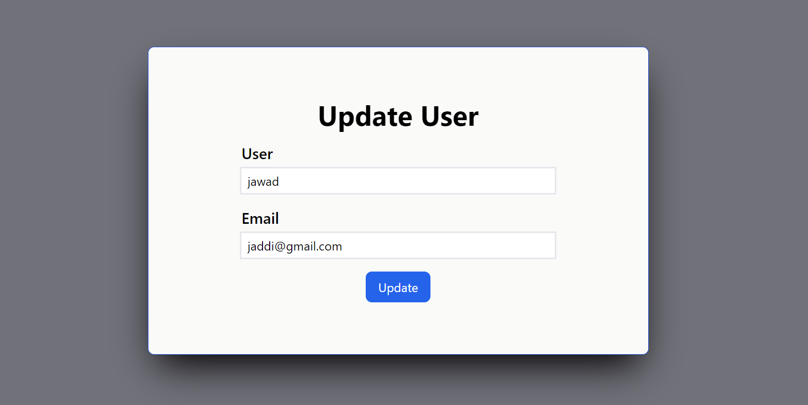

# CRUD App with JSON Server

This is a React application that provides Create, Read, Update, and Delete (CRUD) operations using a JSON Server and Redux Toolkit.

## Features

- All components are designed to be independent and reusable.
- CRUD operations are performed on a JSON Server.
- State management is handled with Redux Toolkit.

## Technologies Used

- [React](https://reactjs.org/) + [Vite](https://vitejs.dev/)
- [React Router Dom](https://reactrouter.com/)
- [Redux Toolkit](https://redux-toolkit.js.org/)
- [Tailwind CSS](https://tailwindcss.com/)

## Screenshots

### All Users

### Create Page

### Update Page

## Installation and Setup

1. Clone the repository: `git clone https://github.com/yourusername/CRUD-App-with-JSON-Server.git`
2. Navigate into the directory: `cd CRUD-App-with-JSON-Server`
3. Install the dependencies: `npm install`
4. Start the JSON Server: `npm run`
5. Start the application: `npm run start`

## Contributing

Pull requests are welcome. For major changes, please open an issue first to discuss what you would like to change.

## License

[MIT](https://choosealicense.com/licenses/mit/)
