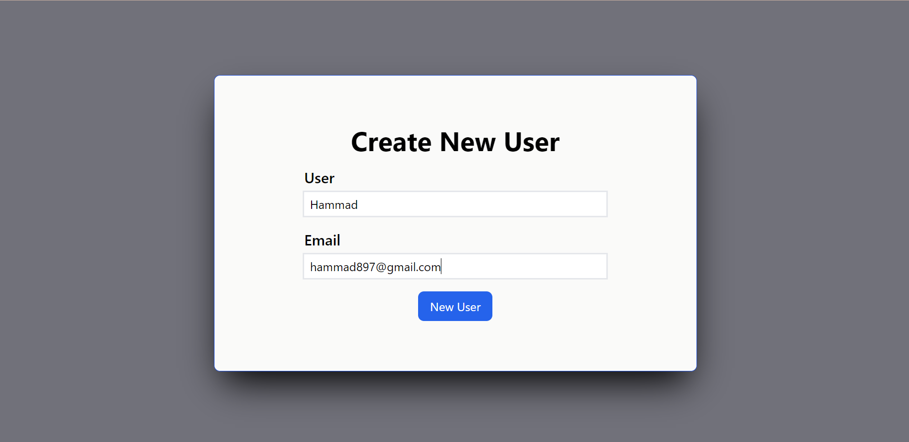

# CRUD APP WITH JSON SERVER

A react app that has functionalities of Create, Read, Update and Delete to the JSON Server with Redux Toolkit.

All  the Compoenets are independent to each other and designs separately.

<h3>Following are packages used to build this App.</h3>
<ul>
<li>React + Vite</li>
<li>React Router Dom</li>
<li>Redux Toolkit</li>
<li>Tailwind CSS</li>
</ul>

<h3> All Users</h3>

<h3> Create Page</h3>

<h3> Update Page</h3>
